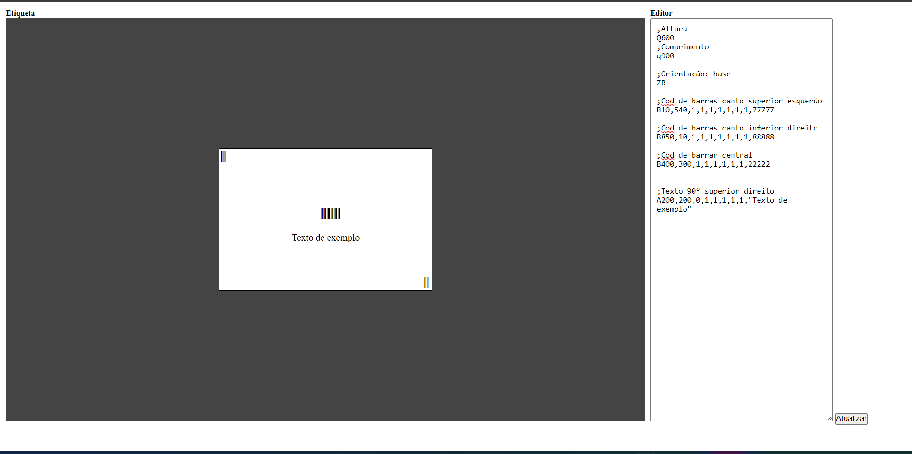

## EPLv0 - EPL Viewer 0

<!--  -->

<center>


Random image :)
</center>
---

**Screenshot**



---

**CDN For experimnents**

```html

    <!-- JS -->
    <script src="https://cdn.jsdelivr.net/gh/LpxsBr/EPLv0@main/src/main.js"></script>

```

```html
    <!-- CSS -->
    <link rel="stylesheet" href="https://cdn.jsdelivr.net/gh/LpxsBr/EPLv0@main/src/style.css">

```
Web Delivery by: [jsDelivr](https://github.com/jsdelivr/jsdelivr)

**Sample**

```s

;Altura
Q600
;Comprimento
q900

;Orientação: base
ZB

;Cod de barras canto superior esquerdo
B10,540,1,1,1,1,1,1,1,77777

;Cod de barras canto inferior direito
B850,10,1,1,1,1,1,1,1,88888

;Cod de barrar central
B400,300,1,1,1,1,1,1,22222


;Texto 90° superior direito
A200,200,0,1,1,1,1,1,"Texto de exemplo"

```

**References**

[Linguagem de programacao zebra EPL](https://zebramaster.blogspot.com/2013/04/linguagem-de-programacao-zebra-epl.html)

[EPL2 Command Information and Details](https://supportcommunity.zebra.com/s/article/EPL2-Command-Information-and-Details?language=pt_BR)